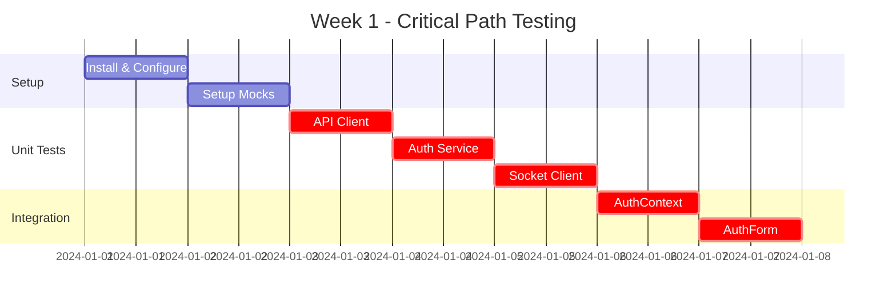

# Test Priority Matrix

Quick reference guide for prioritizing testing efforts to maximize coverage efficiently.

## Priority Levels

- **🔴 CRITICAL** - Must test first, blocks deployment
- **🟠 HIGH** - Important for core functionality
- **🟡 MEDIUM** - Nice to have, enhances reliability
- **🟢 LOW** - Can be tested later

---

## Files Prioritized by Criticality

### 🔴 CRITICAL Priority (Test First)

| File | Lines | Coverage Goal | Risk Level | Reason |
|------|-------|---------------|------------|--------|
| `src/lib/api/client.ts` | 285 | 95% | Very High | Token management, API requests, auth refresh |
| `src/lib/api/services/auth.ts` | 117 | 95% | Very High | Authentication flow, token storage |
| `src/contexts/AuthContext.tsx` | 286 | 95% | Very High | Session management, socket integration |
| `src/lib/socket.ts` | 480 | 90% | Very High | Real-time communication, connection management |
| `src/components/auth/AuthForm.tsx` | 565 | 95% | Very High | User registration and login flows |

**Estimated Effort:** 3-4 days
**Coverage Impact:** ~35% of codebase

---

### 🟠 HIGH Priority (Test Second)

| File | Lines | Coverage Goal | Risk Level | Reason |
|------|-------|---------------|------------|--------|
| `src/lib/api/services/chat.ts` | ~200 | 90% | High | Message delivery, status updates |
| `src/lib/api/services/feed.ts` | ~150 | 90% | High | Content creation and retrieval |
| `src/lib/api/services/user.ts` | ~150 | 90% | High | User profile operations |
| `src/components/chat/ChatWindow.tsx` | ~300 | 85% | High | Real-time messaging UI |
| `src/components/chat/MessageBubble.tsx` | ~150 | 90% | High | Message rendering logic |
| `src/components/feed/PostCard.tsx` | ~200 | 85% | High | Post display and interactions |
| `src/components/feed/CreatePostDialog.tsx` | ~200 | 85% | High | Content creation |
| `src/hooks/useTypingIndicator.ts` | ~50 | 90% | Medium | Real-time indicators |
| `src/lib/chat-utils.ts` | ~100 | 100% | Medium | Message formatting utilities |
| `src/components/auth/ProtectedRoute.tsx` | ~100 | 90% | High | Route protection |
| `src/middleware.ts` | ~100 | 90% | High | Request authentication |

**Estimated Effort:** 4-5 days
**Coverage Impact:** ~30% of codebase

---

### 🟡 MEDIUM Priority (Test Third)

| File | Lines | Coverage Goal | Risk Level | Reason |
|------|-------|---------------|------------|--------|
| `src/lib/api/services/relationships.ts` | ~100 | 85% | Medium | Follow/friend operations |
| `src/lib/api/services/media.ts` | ~100 | 85% | Medium | File uploads |
| `src/components/chat/TypingIndicator.tsx` | ~80 | 85% | Low | Visual indicator |
| `src/components/chat/DateHeader.tsx` | ~50 | 85% | Low | Date formatting |
| `src/components/stories/StoriesTray.tsx` | ~150 | 80% | Medium | Stories display |
| `src/components/profile/ProfileHeader.tsx` | ~150 | 80% | Medium | Profile display |
| `src/components/notifications/RequestItem.tsx` | ~100 | 80% | Medium | Notification display |
| `src/components/ErrorBoundary.tsx` | ~100 | 90% | Medium | Error handling |
| `src/components/ErrorHandler.tsx` | ~50 | 90% | Medium | Error suppression |
| `src/lib/error-handler.ts` | ~37 | 90% | Medium | Console error filtering |
| `src/hooks/use-toast.ts` | ~100 | 85% | Low | Toast notifications |

**Estimated Effort:** 3-4 days
**Coverage Impact:** ~20% of codebase

---

### 🟢 LOW Priority (Test Last)

| File | Coverage Goal | Reason |
|------|---------------|--------|
| `src/lib/utils.ts` | 100% | Simple utility (1-2 hours) |
| `src/lib/placeholder-images.ts` | 80% | Static data |
| `src/lib/constants.ts` | 50% | Configuration |
| `src/components/ui/**` | 50% | Pre-built library (shadcn/ui) |
| `src/components/shared/Logo.tsx` | 70% | Simple presentation |
| `src/components/shared/BottomNavbar.tsx` | 75% | Simple navigation |
| `src/components/shared/MobileFrame.tsx` | 70% | Layout component |
| `src/components/feed/PostCardSkeleton.tsx` | 60% | Loading state |
| `src/components/stories/StoriesTraySkeleton.tsx` | 60% | Loading state |
| `src/lib/api/services/reports.ts` | 75% | Less frequently used |

**Estimated Effort:** 2-3 days
**Coverage Impact:** ~15% of codebase

---

## Test Type Priorities

### Week 1: Foundation (CRITICAL)

**Days 1-2:** Setup + API Client + Auth Service
**Days 3-4:** Socket Client
**Days 5-7:** AuthContext + AuthForm

**Deliverables:**
- ✅ Testing infrastructure
- ✅ 5 critical files tested
- ✅ ~40% coverage achieved

---

### Week 2-3: Core Features (HIGH)

**Week 2:**
- Chat services (2 days)
- Chat components (3 days)

**Week 3:**
- Feed services (2 days)
- Feed components (3 days)

**Deliverables:**
- ✅ Real-time messaging tested
- ✅ Feed functionality tested
- ✅ ~65% coverage achieved

---

### Week 4-5: Supporting Features (MEDIUM)

**Week 4:**
- User services
- Profile components
- Stories components

**Week 5:**
- Relationships
- Media services
- Notifications

**Deliverables:**
- ✅ All major features tested
- ✅ ~80% coverage achieved

---

## E2E Test Priorities

### Phase 1: Critical Journeys (Week 1-2)

1. **Registration Flow** (Day 1)
   - File: `src/__tests__/e2e/registration.spec.ts`
   - Time: 4 hours
   - Impact: Critical user onboarding

2. **Login Flow** (Day 1)
   - File: `src/__tests__/e2e/login.spec.ts`
   - Time: 2 hours
   - Impact: Critical user access

3. **Token Refresh** (Day 2)
   - File: `src/__tests__/e2e/token-refresh.spec.ts`
   - Time: 3 hours
   - Impact: Session persistence

### Phase 2: Feature Journeys (Week 3-4)

4. **Chat Conversation** (Day 1)
   - File: `src/__tests__/e2e/chat.spec.ts`
   - Time: 6 hours
   - Impact: Core feature

5. **Create Post** (Day 2)
   - File: `src/__tests__/e2e/feed.spec.ts`
   - Time: 4 hours
   - Impact: Content creation

6. **Profile Viewing** (Day 3)
   - File: `src/__tests__/e2e/profile.spec.ts`
   - Time: 3 hours
   - Impact: User discovery

### Phase 3: Edge Cases (Week 5-6)

7. **Network Errors**
8. **Socket Reconnection**
9. **Concurrent Users**
10. **Mobile Viewport**

---

## Coverage Milestones

### Milestone 1: 40% Coverage (Week 1)
**Files Tested:**
- ✅ API Client
- ✅ Auth Service
- ✅ Socket Client
- ✅ AuthContext
- ✅ AuthForm
- ✅ E2E: Registration & Login

**Blocker Status:** Can deploy to staging

---

### Milestone 2: 70% Coverage (Week 3)
**Additional Files:**
- ✅ Chat services & components
- ✅ Feed services & components
- ✅ User services
- ✅ Protected routes
- ✅ E2E: Chat & Feed

**Blocker Status:** Can deploy to production

---

### Milestone 3: 85% Coverage (Week 5)
**Additional Files:**
- ✅ All remaining services
- ✅ All components
- ✅ All hooks
- ✅ Error boundaries
- ✅ E2E: All journeys

**Blocker Status:** Production-ready with confidence

---

## Quick Win Tests (High Impact, Low Effort)

These tests provide maximum coverage with minimum effort:

| Test | File | Time | Coverage Gain |
|------|------|------|---------------|
| 1. Utils | `src/lib/utils.ts` | 1 hour | 0.5% |
| 2. Validation Functions | `src/components/auth/AuthForm.tsx` | 2 hours | 1% |
| 3. Chat Utils | `src/lib/chat-utils.ts` | 2 hours | 0.8% |
| 4. Error Handler | `src/lib/error-handler.ts` | 1 hour | 0.3% |
| 5. Constants | `src/lib/constants.ts` | 30 min | 0.2% |

**Total Time:** 6.5 hours
**Total Coverage Gain:** 2.8%

---

## Risk-Based Testing

### Critical Risks (Test Thoroughly)

1. **Token Management**
   - Files: `client.ts`, `AuthContext.tsx`
   - Risk: Users unable to authenticate
   - Test Coverage: 95%+

2. **Socket Connection**
   - Files: `socket.ts`, `ChatWindow.tsx`
   - Risk: Messages not delivered
   - Test Coverage: 90%+

3. **Data Loss**
   - Files: `feed.ts`, `CreatePostDialog.tsx`
   - Risk: User content not saved
   - Test Coverage: 90%+

### Medium Risks (Test Normally)

4. **UI Bugs**
   - Files: All component files
   - Risk: Poor user experience
   - Test Coverage: 80%+

5. **Edge Cases**
   - Files: All service files
   - Risk: Unexpected errors
   - Test Coverage: 85%+

### Low Risks (Test Lightly)

6. **Visual Issues**
   - Files: Skeleton components, shared components
   - Risk: Minor visual bugs
   - Test Coverage: 60%+

---

## Resource Allocation

### 1 Developer Full-Time

**Week 1:** Critical (40%)
**Week 2:** High Priority Part 1 (55%)
**Week 3:** High Priority Part 2 (65%)
**Week 4:** Medium Priority Part 1 (75%)
**Week 5:** Medium Priority Part 2 (85%)

### 2 Developers Full-Time

**Week 1:** Critical + High Priority (60%)
**Week 2:** High + Medium Priority (80%)
**Week 3:** Polish + Edge Cases (90%)

### 3 Developers Full-Time

**Week 1:** All Critical + High Priority (75%)
**Week 2:** All Medium + Low Priority (90%)

---

## Daily Checklist Template

### Day X - Focus: [Feature Name]

**Morning (4 hours):**
- [ ] Review file to be tested
- [ ] Write unit tests for [Component/Service]
- [ ] Achieve [X]% coverage for file
- [ ] Fix any bugs found

**Afternoon (4 hours):**
- [ ] Write integration tests for [Feature]
- [ ] Write E2E test for [User Journey]
- [ ] Review and refactor tests
- [ ] Update coverage report

**End of Day:**
- [ ] Push code with tests
- [ ] Update TEST_PLAN.md progress
- [ ] Document any issues found
- [ ] Plan next day's work

---

## Success Metrics

### Code Coverage
- **Critical Files:** 95%+
- **High Priority:** 90%+
- **Medium Priority:** 85%+
- **Low Priority:** 70%+
- **Overall:** 85%+

### Test Health
- **Pass Rate:** 100%
- **Flaky Tests:** 0%
- **Execution Time:** <5 min (unit), <15 min (E2E)
- **Maintainability:** High (documented, DRY)

### Quality Metrics
- **Bugs Found in Testing:** 50+
- **Bugs Caught Pre-Production:** 100%
- **Regression Rate:** <5%
- **False Positives:** <2%

---

## Summary

Start with CRITICAL files (Week 1) to achieve 40% coverage and ensure core functionality works. Then expand to HIGH priority files (Week 2-3) to reach 70% coverage. Finally, complete MEDIUM and LOW priority files (Week 4-5) to achieve 85%+ coverage.

**Fastest Path to 70% Coverage:**
1. API Client & Auth Service (2 days)
2. Socket Client (1 day)
3. AuthContext & AuthForm (2 days)
4. Chat services & components (3 days)
5. Feed services & components (3 days)
6. Protected routes & middleware (1 day)

**Total Time:** ~12-15 working days with 1 developer

**Recommended Approach:** Focus on critical path first, then breadth, then depth.
